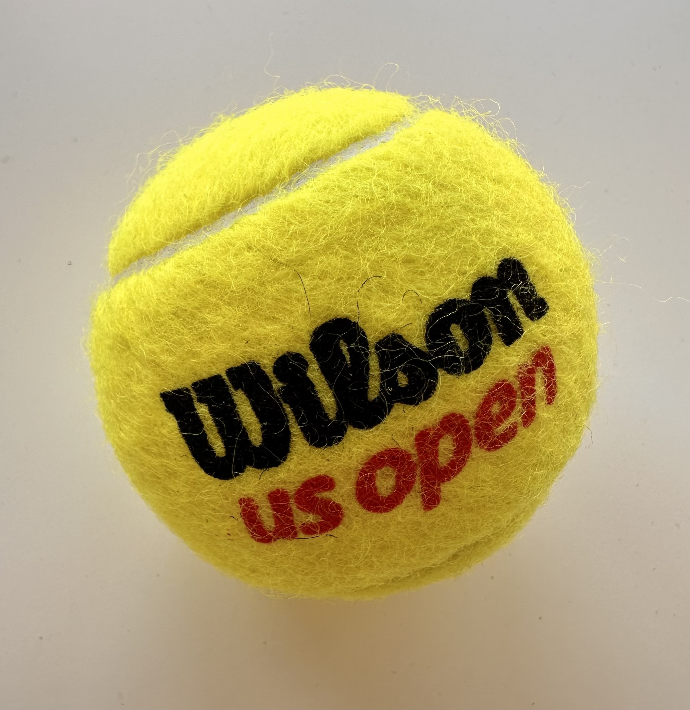

## Welcome to Challengers (p8105 Edition) !

### Group Member 
Laura Henze (lah2231)
Rebecca Shyu (rs4338)
HsiYu Chen (hc3448)
Stacey Dai (sd3730)
Vaiju Raja (vr2576)

### Introduction
With Challengers coming out this year, tennis has become incredibly popular. There have also been many public controversies, especially with Jannik Sinner and his recent doping case that have drawn more people to tennis as well. We want to understand the trends of ATP (men’s tennis) matches at the four grand slams (Australian Open, French Open, Wimbledon, and US Open)

A descriptive report of male tennis players and their performances in the grand slams within the past 5 years. This will be displayed as a website on Github and will be screencasted with explanations.