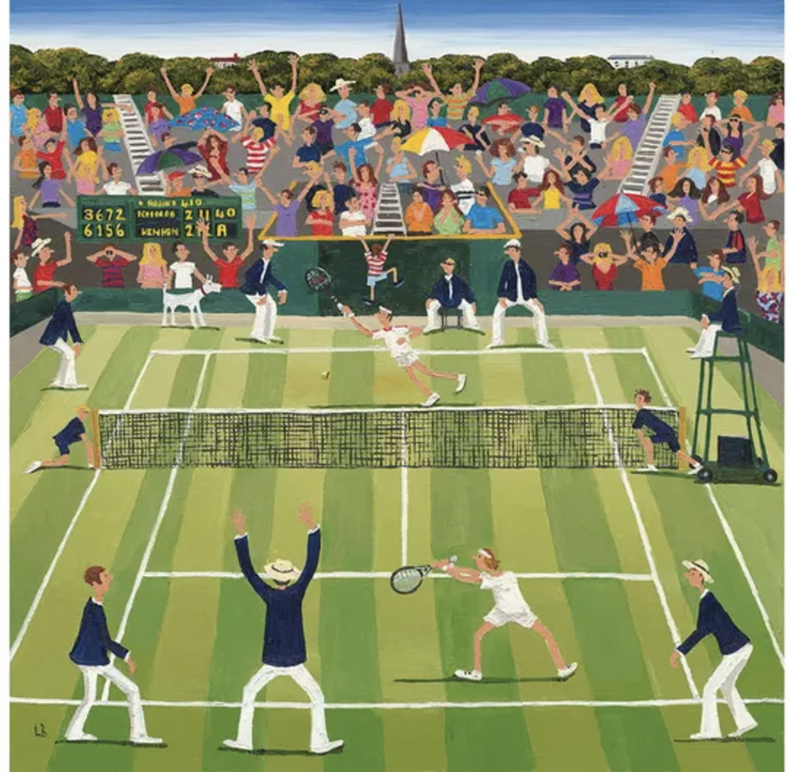

<figure>
  
  <figcaption>(Source: Wentworth Puzzles)</figcaption>
</figure>

 

### Group Members
- Laura Henze (lah2231)
- Rebecca Shyu (rs4338)
- HsiYu Chen (hc3448)
- Stacey Dai (sd3730) 
- Vaiju Raja (vr2576) 

 

### Introduction
Tennis has seen a surge in popularity in recent years, amplified by the release of the film *Challengers* and several high-profile controversies, such as Jannik Sinner’s recent doping case. These events have drawn renewed attention to the sport, sparking interest in the dynamics of player performance at major tournaments. 

Our project focuses on analyzing trends of ATP (professional men’s tennis) matches at the four Grand Slam tournaments – the Australian Open, French Open, Wimbledon, and US Open – over the past 10 years. We aim to explore how player performance is shaped by external factors such as seeding, match duration, and player origins. Additionally, we will investigate how doping cases intersect with performance metrics. 
